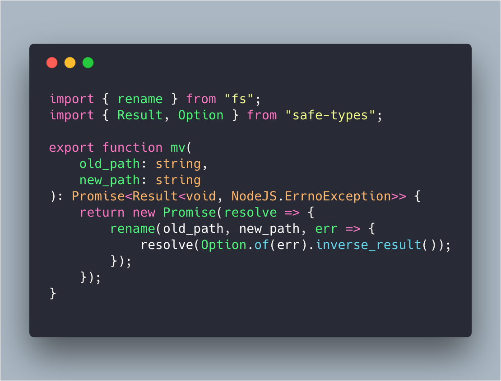
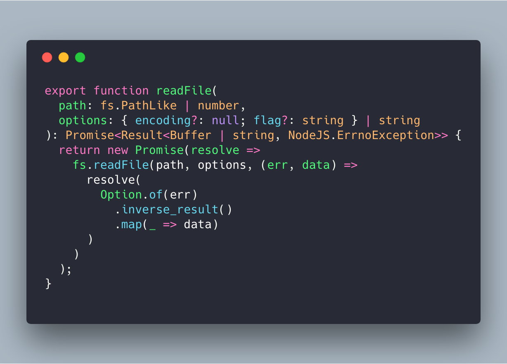
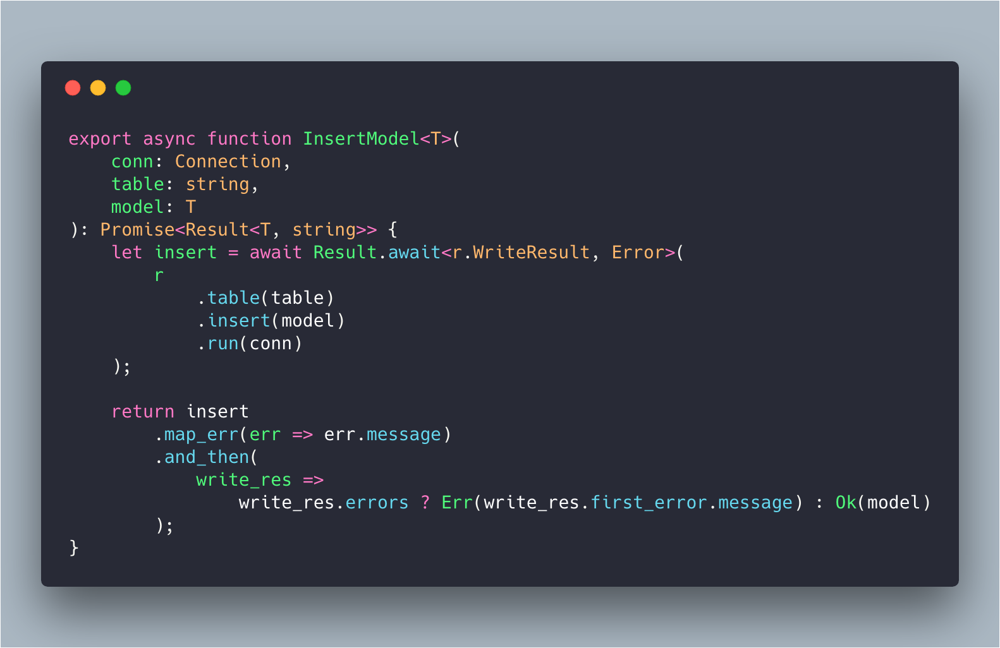
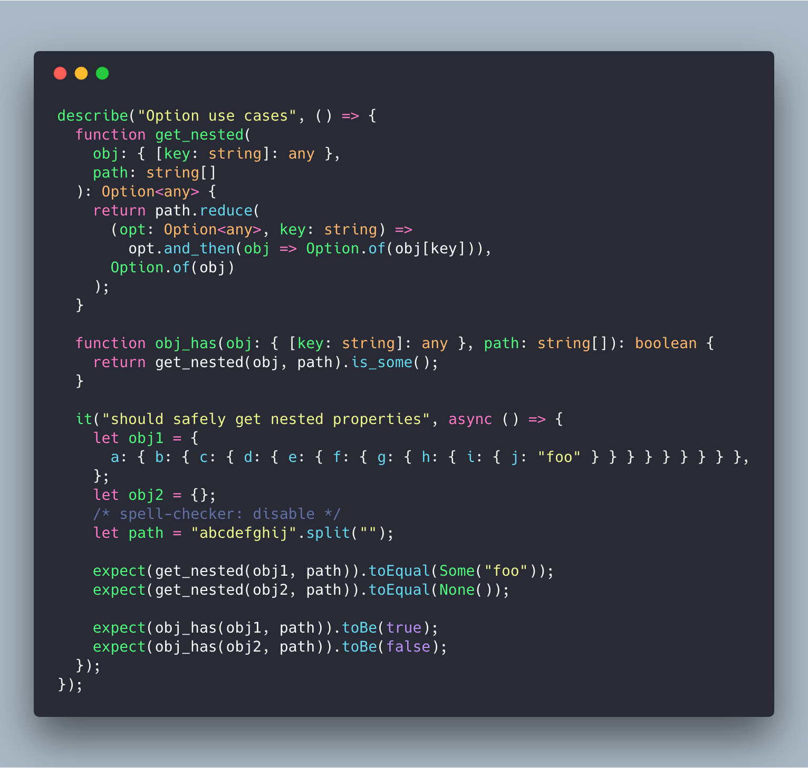
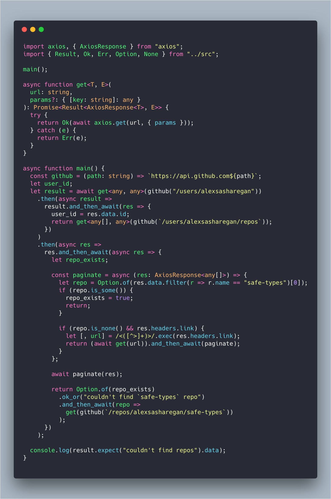

# Safe Types

[](https://img.shields.io/npm/v/safe-types)
[](https://www.npmjs.com/package/safe-types)
[](https://github.com/alexsasharegan/safe-types/issues)
[](https://github.com/alexsasharegan/safe-types)
[](https://coveralls.io/github/alexsasharegan/safe-types)
[](https://github.com/alexsasharegan/safe-types/blob/master/LICENSE.md)

Type safe utils inspired from the Rust language for writing better JavaScript.

## Purpose

Currently, this library is an experiment both to learn Rust concepts as well as
to determine whether some of Rust's types can be mapped to TypeScript and
improve the safety of TypeScript/JavaScript. It's my opinion that a library like
this requires a 100% TypeScript environment to provide security of JS types.
Without the TypeScript compiler and tooling, these primitives may make your data
more opaque rather than provide insight and clarity into the many states
application data can be in.

More documentation to come as I learn how this library best applies to
real-world JavaScript applications!

## Concepts

### Option Type

In Rust, there is no `null` or `undefined` value type. Instead, you can
represent the possibility of not having a value via an Option type.

An option is a simple enum that takes the following shape:

```rs
enum Option<T> {
  None,
  Some(T)
}
```

This declares that an Option can represent a value of an underlying type `T`. It
can exist in one of two states: containing the value (`Some(T)`) or not
(`None`). The powerful concept here is that we can do operations on top of this
wrapper because it can match the underlying value and disregard our operation
when the value is None.

Think of an operation that queries the DOM for an input element (maybe a
password input), gets the value inside, and then checks to make sure it's of
sufficient length.

```js
let isValidLength = document.querySelector("#password").value.length > 8;
```

While this code is simple, we know that `document.querySelector` can return any
element, or null. So we could get null, and then an Error would be thrown for
trying to access `value` on `null`, or we could get back an element that might
not have a `value` property, so it returns `undefined`. Here's how we can do the
same thing safely with an Option type:

```ts
let pw_len = Option.of<HTMLInputElement>(document.querySelector("#password"))
  .and_then<string>(input => Option.of(input.value))
  .map<number>(value => value.length);
pw_len.unwrap();
// number | new Error()
```

The extra type syntax here is for clarification (TypeScript can infer most
types). We start by creating an Option of an `HTMLInputElement`, since
`querySelector` can return an element or `null`. If we return
`Some<HTMLInputElement>`, we then access the `value` property. If we
accidentally returned an element that wasn't an input, we could get `undefined`.
Last, we map over the value property to get it's length.

There's a lot that could go wrong here, but at the end we've secured ourself
from generating an Error without writing a handful of `if` statements or awkward
`||` statements like:

```js
((document.querySelector("#password") || {}).value || "").length;
```






